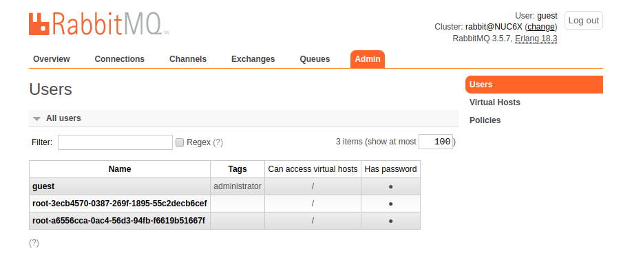

# RabbitMQ and Hashicorp Vault demo
## Context and content

- [RabbitMQ](https://www.rabbitmq.com/) is an open source message broker software implementing several message queuing protocols: AMQP, STOMP, MQTT, etc.

- [Hashicorp Vault](https://www.vaultproject.io/) is an open source tool for managing secrets.

This repo contains some notes to demo Vault with RabbitMQ credentials and it also contains two simple Python scripts to interact with the RabbitMQ broker with simple messages using the Pika library.

- Publisher.py
- Consumer.py

## Demo set up

### Requirements

Carry out this demo on an Ubuntu 18.04 box with the RabbitMQ server installed and the Pika library (Python3) installed if you want to test messaging.

```
sudo apt-get install rabbitmq-server
sudo apt-get install python3-amqp 
sudo apt-get install python3-pika python3-pika-pool
```

### RabbitMQ

Check that the rabbitmq status and make sure that is up and running.

```
sudo rabbitmqctl status
```

Enable the RabbitMQ management plugin:

```
sudo rabbitmq-plugins enable rabbitmq_management
```

### Vault

This demo assumes you have vault up and running. If you need help deployin Vault, check https://learn.hashicorp.com/vault/getting-started/deploy.

Enable the RabbitMQ secret engine:

```
vault secrets enable rabbitmq
```

Config Vault as it needs to know the URI and credentials to communicate with RabbitMQ. In the example I have used localhost , the port 15672 and the default credentials when you install the RabbitMQ. Modify these values as needed.

```
vault write rabbitmq/config/connection connection_uri="http://localhost:15672" username="guest" password="guest"
```

And finally configure a role that maps a name in Vault to virtual host permissions.

```
vault write rabbitmq/roles/my-role vhosts='{"/":{"write": ".*", "read": ".*"}}'
```

## Demo the generation and revocation of credentials

### Generating credentials:

Just read from the Vault path to generate the credentials:

```
vault read rabbitmq/creds/my-role
```

You will see something similar to this output:

```css
your_user@your_hostname:~/$ vault read rabbitmq/creds/my-role
Key                Value
---                -----
lease_id           rabbitmq/creds/my-role/84d86cc4-8503-6ccf-9de2-b40xxxxedbfe
lease_duration     768h
lease_renewable    true
password           0c895f65-58b0-3bf0-cc56-f09xxxx05b32
username           root-3ecb4570-0387-269f-1895-55c2decb6cef 
```

You can now check that Vault has generated the credentials listing the RabbitMQ users with the cli tool rabbitmqctl:

```css
your_user@your_hostname:~/$ sudo rabbitmqctl list_users
Listing users ...
admin	[administrator]
root-3ecb4570-0387-269f-1895-55c2decb6cef       []
```
Or if you fancy web interfaces, point your browser to the web admin tool that should be accessed on the URL "Your_RabbitMQ_server:15672/#/users" of the host running the RabbitMQ server.



### Revoking credentials:

Revoke the lease associated with the credentials that you want to get rid of with

```
vault lease revoke <lease_id>
```

You will see something similar to this output:

```css 
your_user@your_hostname:~$ vault lease revoke rabbitmq/creds/my-role/25711418-2044-a3f8-4917-bfxxxx47d3b8
Success! Revoked lease: rabbitmq/creds/my-role/25711418-2044-a3f8-4917-bfxxxx47d3b8
```


### Messaging

Additionally if you want to publish simple messages and subscribe to them, you can use the scripts provided:

- Start the consumer:

```css 
your_user@your_hostname:~$ ./consumer.py
 [*] Waiting for messages. To exit press CTRL+C
```

- Send a message with the publisher:

```css 
your_user@your_hostname:~$ ./publisher.py 
 [x] Sent 'Hello World!'
```

- Then the consumer will get and process the message:

```css 
your_user@your_hostname:~$ ./consumer.py 
 [*] Waiting for messages. To exit press CTRL+C
 [x] Received b'Hello World!'
```

## Troubleshooting and extra notes:

If you try to config vault using the port 5672 you might get this error:

```css
failed to validate the connection: Get http://localhost:5672/api/users/: net/http: HTTP/1.x transport connection broken: malformed HTTP response "AMQP\x00\x00\t\x01"
```

The Port 5672 is used by AMQP 0-9-1 and 1.0, not the HTTP API. In order to communicate with the HTTP API use the port 15672 and the plugin rabbitmqadmin.
